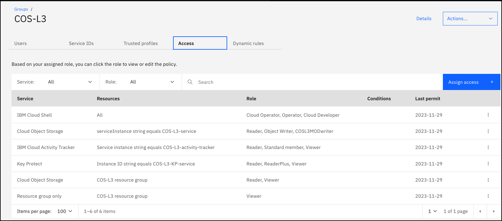

# SalesEnablement-COS-L3
Sales Enablement Level 3 for IBM Cloud Object Storage

**ITZ Collection:** https://techzone.ibm.com/collection/ibm-cloud-object-storage-level-3

**ITZ Environment:** https://techzone.ibm.com/my/reservations/create/632a16a9b5bcd200178af909

**ITZ gitops pattern:** https://github.ibm.com/dte2-0/ccp-gitops-patterns/tree/main/ibm-cos-se-l3

**ITZ account:** ITZ - ADHOC03

## Summary of environment and automation

For this lab, no new resources are provisioned as part of the ITZ automation; however, the user is instructed to create objects in the pre-provisioned COS buckets. The lab consists of many click-thru demonstrations, pre-provisioned instances of COS and Event Tracker.

In the ITZ automation:

- users are added to the above ITZ account
- users are added to the COS-L3 IAM access group. The access group has the following access roles/policies defined:



## Maintenance

**To perform the maintenance steps below, you must have admin access in the ITZ IBM Cloud account: 2305900 - iTZ - ADHOC03.**

1. Verify the following resources are available:

**COS instance:** COS-L3-service *(us-south)*
**COS buckets (in above instance):** cos-l3-with-retention and cos-l3-without-retention *descriptions of the settings for the buckets can be found in the demonstration guide*
**Activity Tracker instance:** COS-L3-activity-tracker *(us-south)*
**Key Protect instance:** COS-L3-KP-service
**Key Protect root key:** COS-L3-RootKey-1

2. Users are instructed to create and remove several objects while executing this lab. The nice thing about the lab is that users are only instructed to create objects in the cos-l3-with-retention bucket which has a maximum retention period set of 6 days and a lifecycle policy of: *Expire after 7 days*. The cos-l3-without-retention bucket has the same lifecycle policy. So any objects created will automatically be removed after 7 days.

3. In rare cases, the ITZ automation may fail with a reservation expires and leave users in the cloud account. Run the following commands/scripts in IBM Cloud Shell or on your machine if you have the IBM Cloud CLI's installed (along with VPC plugin). The script assumes you are authenticated (ibmcloud login -sso). It will also remove any stray users (interactively). You could also do this manually through the IBM Cloud Portal.

```
wget -O itzCOSMaintenance.perl https://raw.githubusercontent.com/IBM/SalesEnablement-COS-L3/main/tools/itzCOSMaintenance.perl

chmod +x itzCOSMaintenance.perl

perl ./itzCOSMaintenance.perl
```
