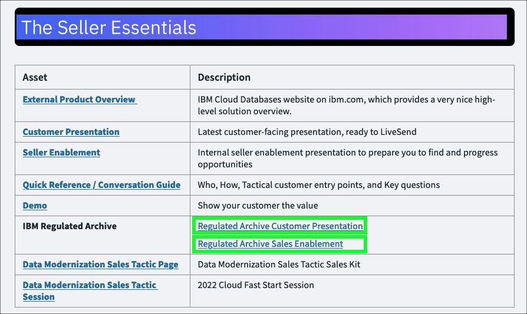

To be written

This demonstration guide is based upon the {{offering.name}} Regulated Archive Demonstration.

**In this demonstration environment, full access to the IBM Cloud account is NOT provided.** User identifications (IDs) will be restricted to specific capabilities. Permission to create or modify COS service instances, COS buckets, Key Protect instances, etc. is not provided.

Reference
https://ibm.seismic.com/Link/Content/DCGCjHR8Jp2GqGTM3bc3bcR3P4Wd

Architecture
