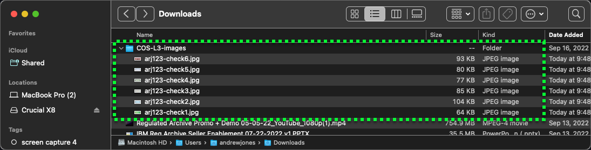

Now that all the provisioning and configuration of the environment is complete, it is time to utilize COS as part of a regulated archive solution. Specifically, the scenario will be:

- ingest data into COS
- specify object-specific retention durations
- place legal holds on data
- restore data
- attempt to delete data from COS to validate retention policies and legal holds are honored

And while performing the above steps, **Activity Tracker** will be leveraged to validate the audit readiness of the actions performed.

Before getting started, a few important notes. As mentioned before, this is a shared environment. All users of the environment have the ability to upload, download, and delete all content added to the pre-provisioned buckets. Users should only work with objects they create. Do NOT upload any files that contain confidential or proprietary information. Note also, as a safeguard, all uploaded objects will be removed after 7 days using an expiry rule set on the COS bucket.

For this demonstration script, users should create 4 to 6 small files that will be uploaded to COS. While COS will accept any tile type and files can be very large, users are encouraged to utilize small files to minimize upload times. The following links can be used to download 6 sample bank checks that can be used. To download, right click on the links below and depending on browser select:

- "Save link as" - Chrome and Firefox
- "Download linked file as" - Safari

!!! important
    When saving the file, add a unique prefix to the file name. For example, save check1.jpg as arj123_check1.jpg.  Using a unique prefix will avoid file name conflicts with others using this shared environment.

https://ibm.github.io/SalesEnablement-PowerVS-L3/includes/checkImages/check1.jpg
https://ibm.github.io/SalesEnablement-PowerVS-L3/includes/checkImages/check2.jpg
https://ibm.github.io/SalesEnablement-PowerVS-L3/includes/checkImages/check3.jpg
https://ibm.github.io/SalesEnablement-PowerVS-L3/includes/checkImages/check4.jpg
https://ibm.github.io/SalesEnablement-PowerVS-L3/includes/checkImages/check5.jpg
https://ibm.github.io/SalesEnablement-PowerVS-L3/includes/checkImages/check6.jpg

