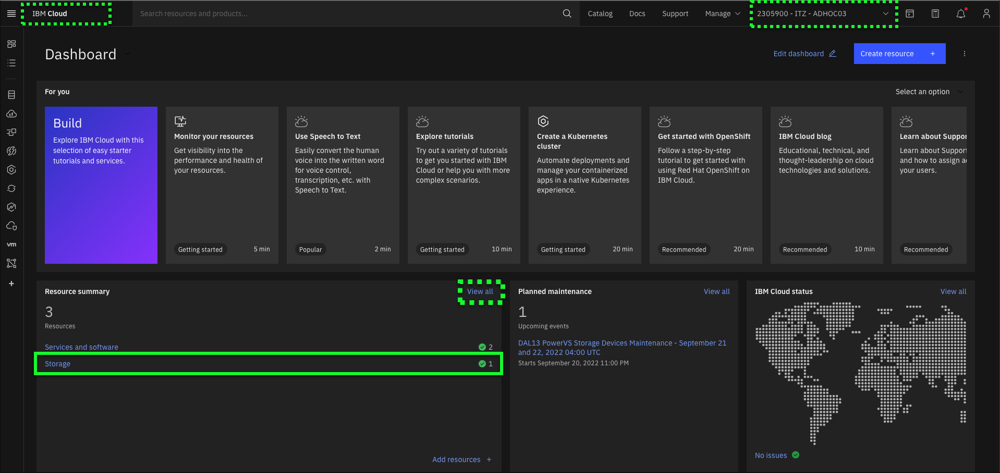
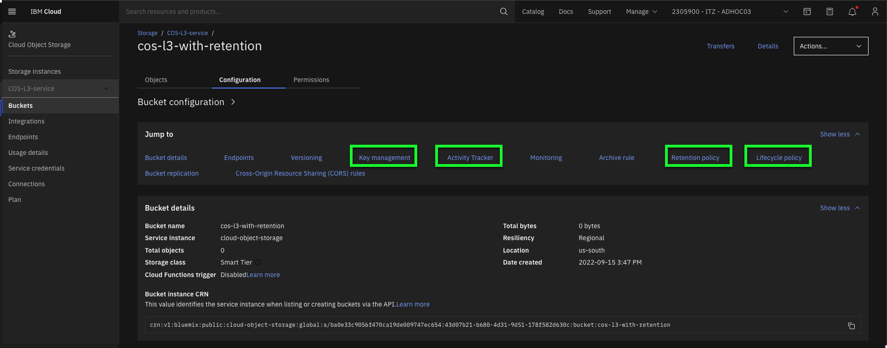

In this chapter, explore the configurations of the pre-provisioned buckets.

!!! Important
    Before proceeding, all users should verify their IBM Technology Zone Environment is **Ready** and the invitation to join the **{{account}}** has been accepted. The invitation e-mail subject line is **Account: You are invited to join an account in IBM Cloud** and was sent by **no-reply@cloud.ibm.com**

1. Open the IBM Cloud Portal: <a href="https://cloud.ibm.com/" target="_blank">https://cloud.ibm.com/</a> and authenticate.
2. Change to the **{{account}}** account.

!!! tip
    If the browser window is narrow, this icon:  may be seen instead of the current account name as shown in the screen capture above.

3. Click **Storage** under **Resource summary** on the IBM Cloud Dashboard.

The **_View all_** link under **Resource summary** may need to be clicked to display the current resources.

4. Click **{{COS.serviceInstanceName}}** in the **Storage** resource list.

5. Click **{{COS.bucket1}}** in the **Buckets** table.

6. Click the **Configuration** tab.

!!! Important
    The image above was captured prior to content being uploaded. This view will change depending on what content is currently stored in COS. Expect to see differences in the **Objects** table.

At this point, explore the various sections on the **Configuration** page for the bucket. Three specific sections to explore are: **Key management**, **Activity Tracker**, **Retention policy** and **Lifecycle policy**.

!!! Reminder
    Users have limited permissions in the shared environment, so options to modify the bucket are disabled.

Take a few minutes to explore the configuration settings of the other pre-provisioned bucket: **{{COS.bucket2}}**.
