Next, follow the steps below to verify the retention policies created for the bucket.

To complete the next steps, users will be utilizing three (3) browser windows:

- Browser window with this demonstration script

- Browser window with IBM Cloud Portal accessing the COS bucket user interface

- Browser window with IBM Cloud Activity Tracker

Once all windows are started, arrange them on separate monitors if available or resize the windows so they are all visible at same time. Note, each page utilizes reactive web interfaces which when resized by hide certain menus or icons.

1. If not already opened from previous exercise, open a browser window to the {{COS.bucket1}} page <a href="https://cloud.ibm.com/objectstorage/crn%3Av1%3Abluemix%3Apublic%3Acloud-object-storage%3Aglobal%3Aa%2Fba0e33c9056f470ca19de009747ec654%3A43d07b21-b680-4d31-9d51-178f582d630c%3A%3A?bucket=cos-l3-with-retention&bucketRegion=us-south&endpoint=s3.us-south.cloud-object-storage.appdomain.cloud&paneId=bucket_overview" target="_blank">here</a>.

2. Open the IBM Cloud Portal Activity Tracker page: <a href="https://cloud.ibm.com/observe/activitytracker" target="_blank">https://cloud.ibm.com/observe/activitytracker</a>.

Activity Tracker can also be accessed via the IBM Cloud Portal's left hand navigation hamburger menu under the **Observability** section.

3. Click {{ActivityTracker.serviceInstanceName}} in the table.

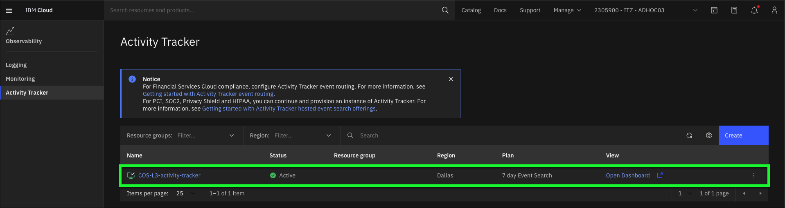

After the Activity Tracker details page loads, take note of the **7 day Event Search** plan utilized.

4. Click **Open Dashboard**.

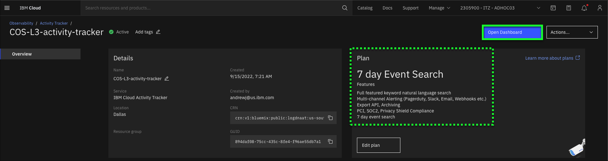

The **Activity Tracker** Dashboard will open in a new browser tab or window.

This demonstration script prescriptively specifies steps to take in the **Activity Tracker** Dashboard. Learn more about using **Activity Tracker** <a href="https://cloud.ibm.com/docs/activity-tracker?topic=activity-tracker-getting-started-search" target="_blank">here</a>.

5. Click the **Sources** pulldown menu, check the **cloud-object-storage** checkbox, and click **Apply**.

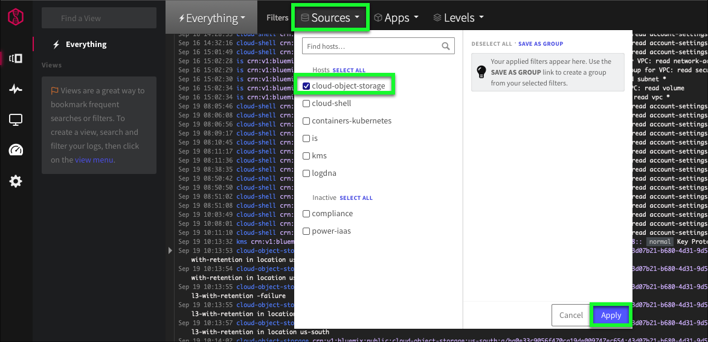

In this step, a filter for **Activity Tracker** is set to minimize the events displayed to only those related to COS. Using filters is very useful, especially when a lot of events are being triggered.

At this time, there may or may not be events displayed in the **Activity Tracker** Dashboard. Don't worry if there are not any at this point.

6. If possible, arrange the two browsers windows side-by-side such that both the **Activity Tracker** Dashboard and the IBM Cloud Portal page for the {{COS.bucket1}} are visible.

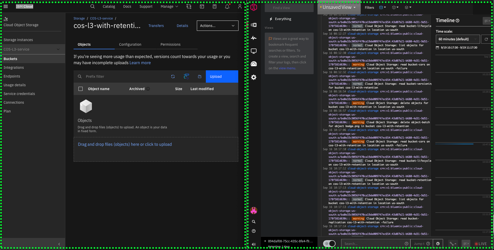

7. On the IBM Cloud Portal page, click the **Upload** button on the **Objects** tab of the **{{COS.bucket1}}** bucket.

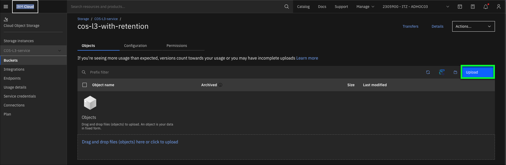

8. Click the **Upload files** button.

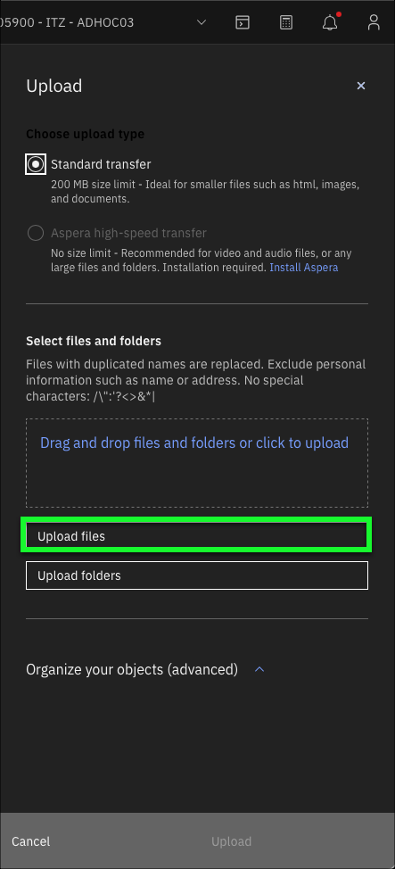

9. In the **Choose Files to Upload** dialog, select the first file to upload to COS, and click **Upload**.

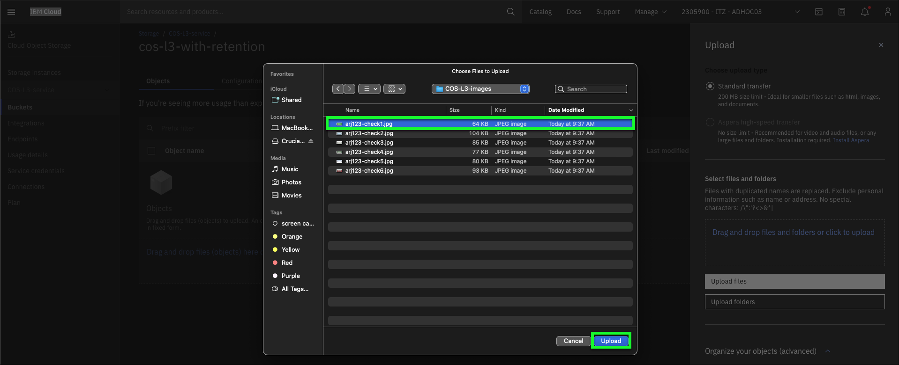

10. Click the up arrow next to the **Organize your objects (advanced)** section of the Upload dialog.

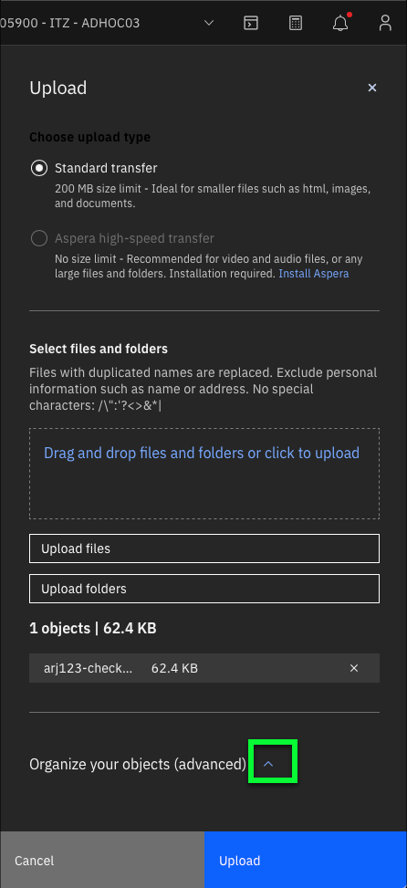

11. Scroll down to the **Retention** section of the **Organize your objects (advanced)** section.

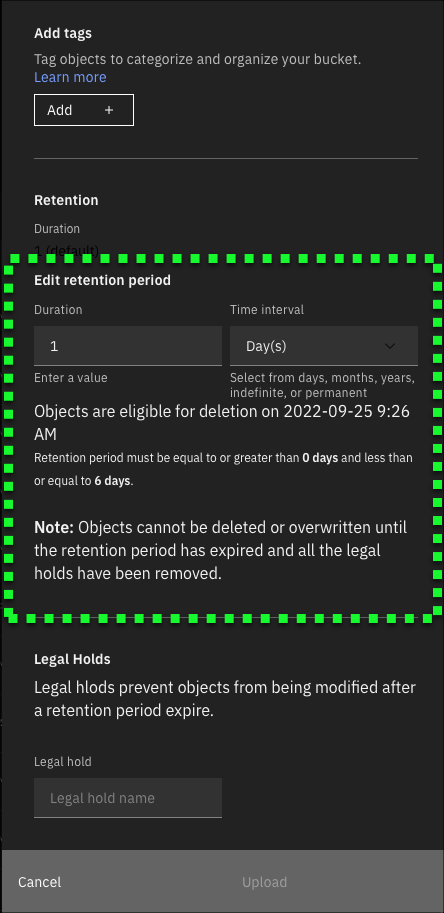

A couple of items to note. The default **Duration** is set to 1 day. Recall this from the **bucket** settings. Also note, the **eligible for deletion** date should align with the maximum retention value of the **bucket**.

12. Change the **Duration** field from **1** to **0** days and click **Upload**.

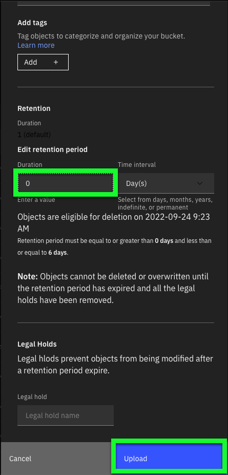

A **Transfers** dialog will appear, and an **Upload Success** message should also be displayed. Clear these by clicking the **x** for each dialog. Additionally, now in the bucket details table, the newly upload object should be listed. Note, use the table search or use the **Object name** sort option in the table to find the uploaded object.

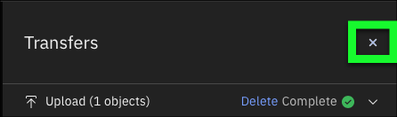

13. Switch to the **Activity Tracker** Dashboard.

14. Click to the left of the **create object** event in the Dashboard that relates to the image that was just uploaded.

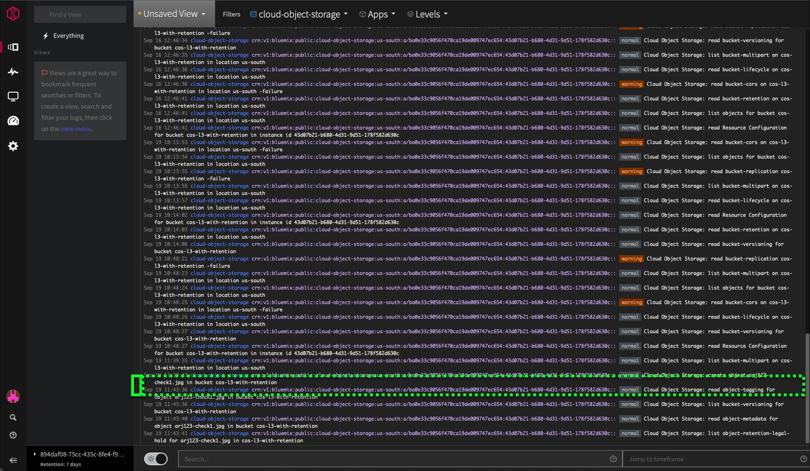

Note, the **create object** event should be towards the bottom of the listing. Once located, click just to the left of the line in the table. This will expand the entry.

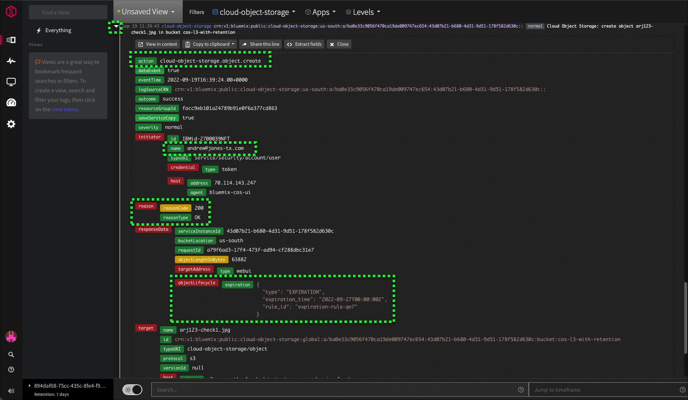

15. In the IBM Cloud Portal, click the **checkbox** next to the uploaded file.

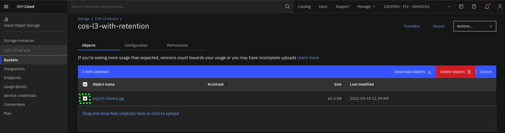

Notice the two new options available: **Download objects** and **Delete objects**.

16. Click **Download objects**.

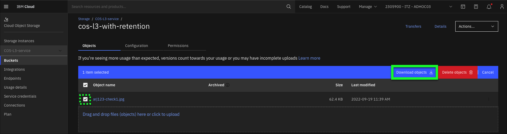

The **Transfers** dialog shows the download progress and success. Dismiss the **Transfers** dialog by clicking the **X** at top right.

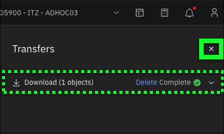

17. Select the **checkbox** beside the filename again, and click **Delete objects**.

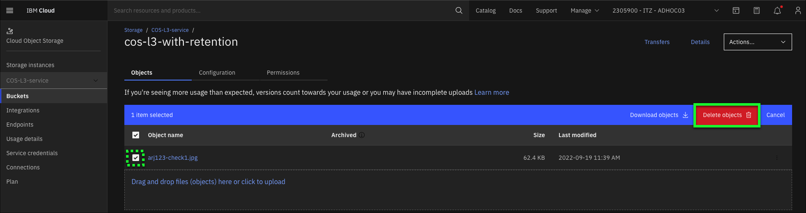

Based upon the retention policies specified for this object and the bucket, can the object be deleted at this time?

18. Enter **Permanently delete** in the text entry field, and click the **Delete** button.

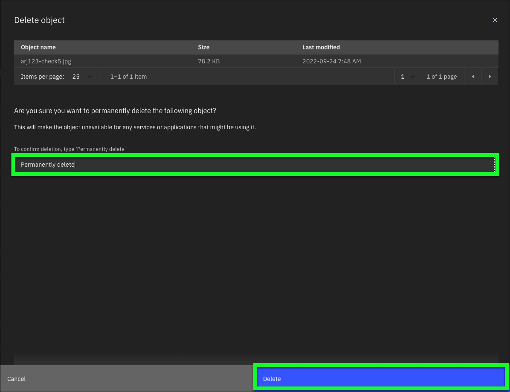

Since the object was uploaded with a **0 Day** retention, it can be deleted.

19. Switch to the **Activity Tracker** Dashboard.

20. Find and expand the two (2) **delete** events in the Dashboard.

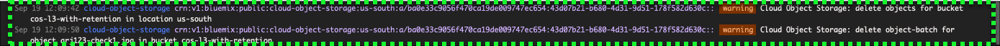

Once located, click just to the left of each line in the table. This will expand the entry, like the image below. There will often be multiple events logged by **Activity Tracker** from a single user action.

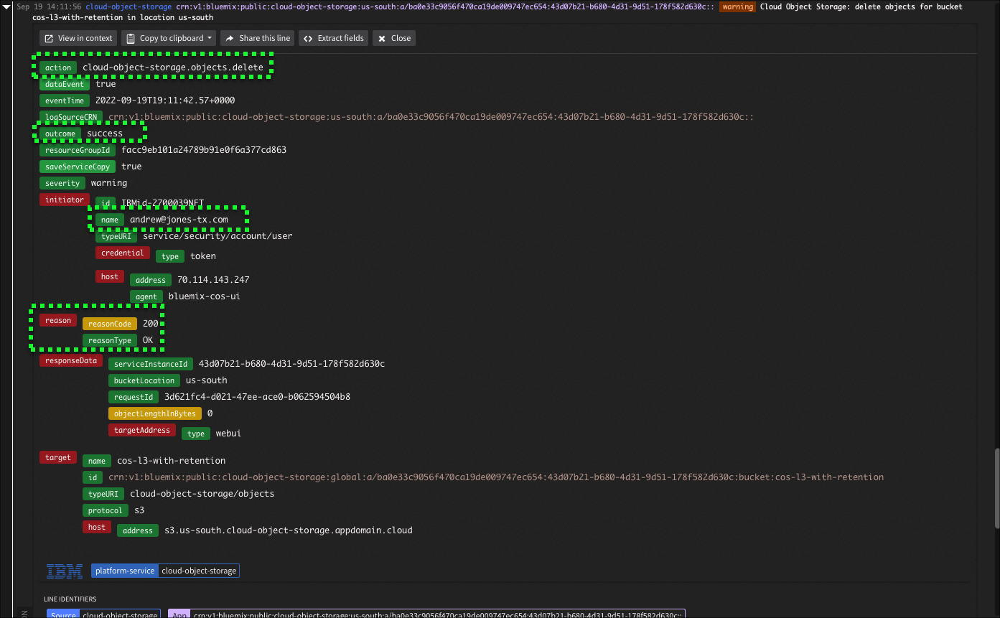

Take note of the details that **Activity Tracker** logged.

**On the IBM Cloud Portal page, repeat steps seven (7) through 12 to upload another file to COS. This time, on step 12, set the Duration to a value between one (1) and (6).** Recall, the maximum retention period for the bucket is set to 6.

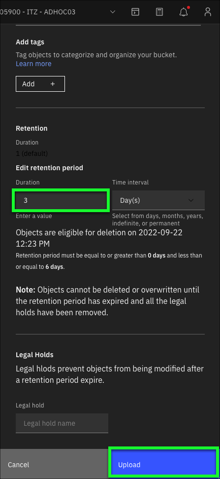

What will happen if an attempt is made to delete this recently uploaded file?

21. On the IBM Cloud Portal page, select the newly uploaded file and click **Delete objects**.

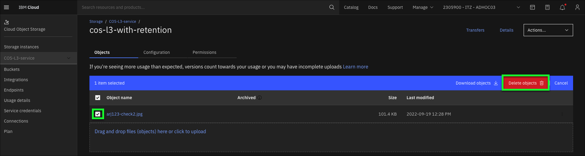

22. In the **Delete object** dialog, enter **Permanently delete** and click the **Delete** button.

Did the **delete** succeed? Why not?

A message the like the image below should be displayed stating the delete did not succeed "due to an attached policy".

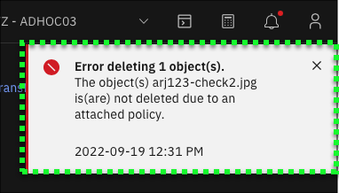

23. Switch to the **Activity Tracker** Dashboard.

24. Locate the two (2) new **delete** events in the Dashboard.

Note, these should show a **warning** status instead of **normal**.

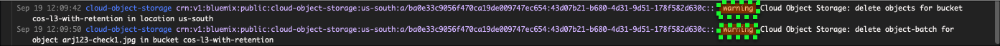

25. Expand the first event **delete** event in the Dashboard by clicking just to the left of the entry.

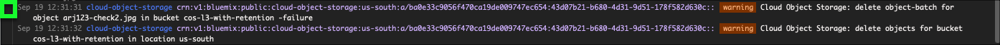

Notice the following fields in the event that are now audit ready.

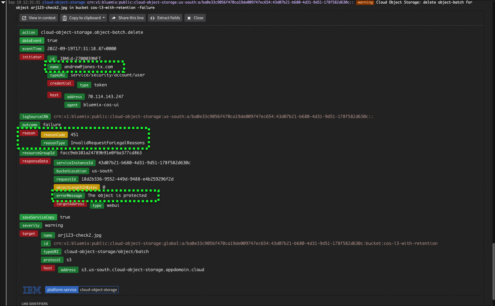

Because the expiration for the object was set with a three (3) day retention period, the object cannot be removed. This object will remain in COS until either one of the following two actions occur:

- The object is deleted after the 3 day retention period by someone with appropriate permissions.
- The object is automatically deleted after the 7 day expiry occurs as set on the bucket.

Notice there is a second bucket that has been provisioned with no retention policies: {{COS.bucket2}}. Feel free to use this bucket as part of client demonstrations.

In the next chapter, explore how **legal holds** can be used to further protect regulated data.
