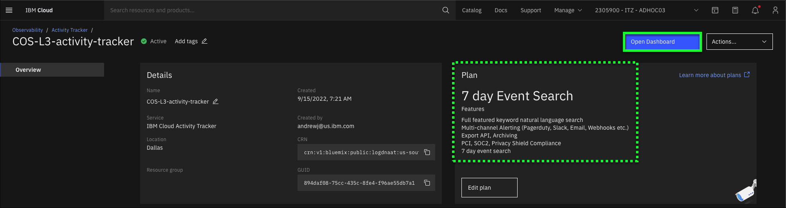
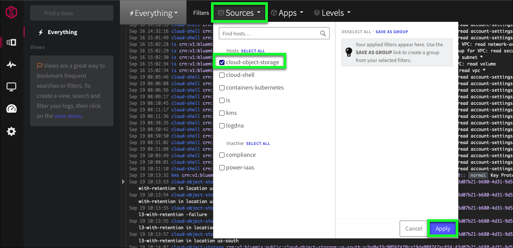
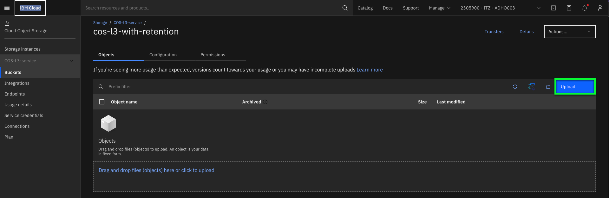
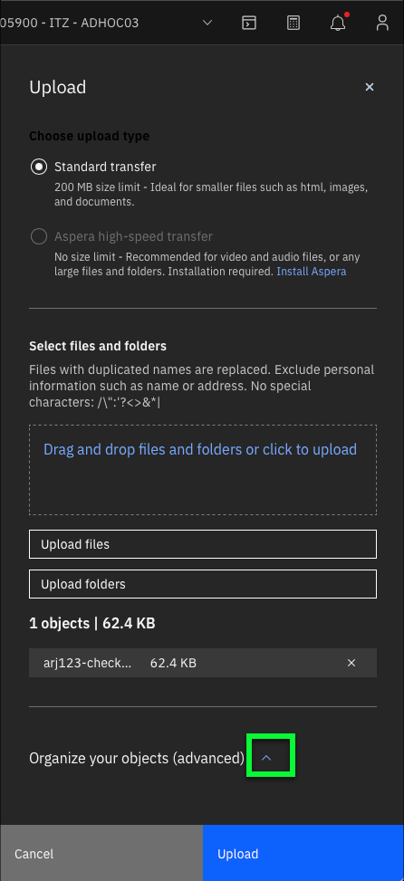
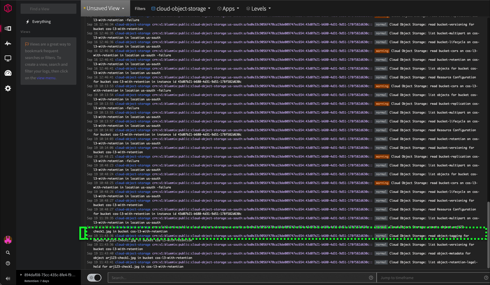
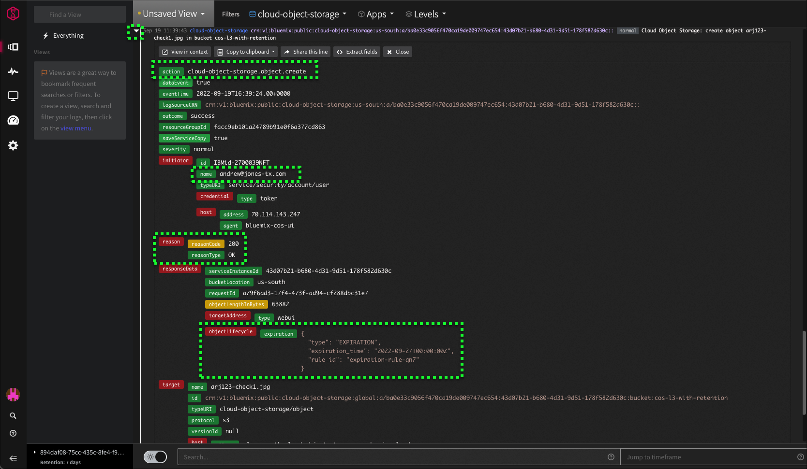
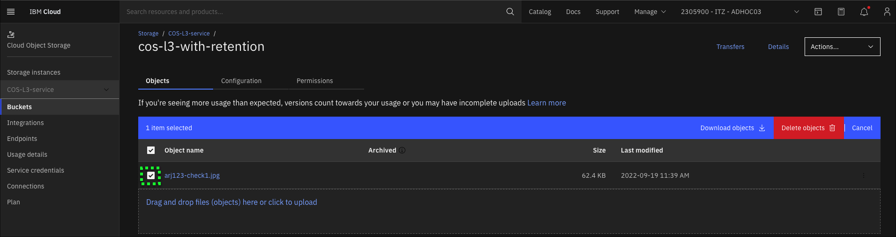
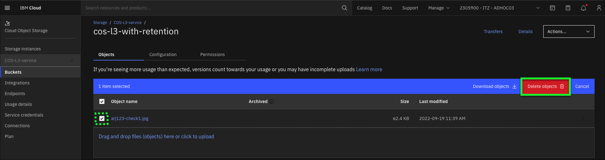
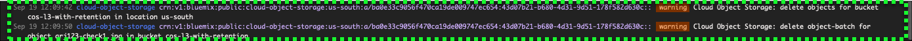

To complete the next steps, users will be utilizing three (3) browser windows:

1. Browser window with this demonstration site_description
2. Browser window with IBM Cloud Portal accessing the COS bucket user Interfaces
3. Browser window with IBM Cloud Activity tracker

Once all windows are started, arrange them on separate monitors if available or resize the windows so they are all visible at same time. Note, each page utilizes reactive web interfaces which when resized by hide certain menus or icons.

1. If not already opened from previous exercise, open a browser window to the {{COS-bucket-1}} page <a href="https://cloud.ibm.com/objectstorage/crn%3Av1%3Abluemix%3Apublic%3Acloud-object-storage%3Aglobal%3Aa%2Fba0e33c9056f470ca19de009747ec654%3A43d07b21-b680-4d31-9d51-178f582d630c%3A%3A?bucket=cos-l3-with-retention&bucketRegion=us-south&endpoint=s3.us-south.cloud-object-storage.appdomain.cloud&paneId=bucket_overview" target="_blank">here</a>.

2. Open the IBM Cloud Portal Activity Tracker page: <a href="https://cloud.ibm.com/observe/activitytracker" target="_blank">https://cloud.ibm.com/observe/activitytracker</a>.

3. Click {{ActivityTracker.serviceInstanceName}} in the table.

After the Activity Tracker details page loads, take note of the **7 day Event Search** plan utilized.

4. Click **Open Dashboard**.

The **Activity Tracker** Dashboard will open in a new browser tab or window.

This demonstration script prescriptively specifies steps to take in the **Activity Tracker** Dashboard. Learn more about using **Activity Tracker** <a href="https://cloud.ibm.com/docs/activity-tracker?topic=activity-tracker-getting-started-search" target="_blank">here</a>.

5. Click the **Sources** pulldown menu, check the **cloud-object-storage** checkbox, and click **Apply**.

In this step, a filter for **Activity Tracker** is set to minimize the events displayed to only those related to COS. Using filters is very useful, especially when a lot of events are being triggered.

At this time, there may or may not be events displayed in the **Activity Tracker** Dashboard. Don't worry if there are not any at this point.

6. If possible, arrange the two browsers windows side-by-side such that both the **Activity Tracker** Dashboard and the IBM Cloud Portal page for the {{COS-bucket-1}} are visible.

7. Click the **Upload** button.

8. Click the **Upload files** button.

9. In the **Choose Files to Upload** dialog, select the first file to upload to COS, and click **Upload**.

10. Click the up arrow next to the **Organize your objects (advanced)** section of the Upload dialog.

11. Scroll down to the **Retention** section of the **Organize your objects (advanced)** section.

A couple of items to note.  The default **Duration** is set to 1 day.  Recall this from the **bucket** settings.  Also note, the **eligible for deletion** date which should align with the maximum retention value of the **bucket**.

12. Change the **Duration** field from **1** to **0** days and click **Upload**.

A **Transfers** dialog will appear and a **Success**  message should also be displayed.  Clear these by clicking the **x** for each dialog. Additionally, now in the bucket details table, the newly upload object should be listed. Note, use the table search or use the **Object name** sort option in the table to find the uploaded object.

13. Switch to the **Activity Tracker** Dashboard.

14. Click to the left of the **create object** event in the Dashboard.

Note, the **create object** event should be towards the bottom of the listing. Once located, click just to the left of the line in the table.  This will expand the entry.

13. Click the object name for the newly uploaded object.

Examine the details that **Activity Tracker** recorded for the creation of the object. As highlighted in the image above, note the **action** that caused the event to be tracked, who the **initiator** was, the **reason** code, and the **objectLifecycle** information.

14. In the IBM Cloud Portal, click the **checkbox** next to the uploaded file.

Notice the two new options available: **Download objects** and **Delete objects**.

15. Click **Download objects**.

The **Transfers** dialog shows the download progress and success.  Dismiss the **Transfers** dialog by clicking the **X** at top right.

16. Select the filename again, and click **Delete objects**.

Based upon the retention policies specified for this object and the bucket, can the object be deleted at this time?

17. Click the **Delete** button.

Since the object was uploaded with a **0 Day** retention, it can be deleted.

18. Switch to the **Activity Tracker** Dashboard.

19. Find and expand the two (2) **delete** events in the Dashboard.

Note, the **create object** event should be towards the bottom of the listing. Once located, click just to the left of the line in the table.  This will expand the entry.

    - Upload an object to bucket w/ retention policy of 1 to 3 days(Do)
    - View object details (Do)
    - View activity tracker (Do)
    - Attempt to delete an object (Do) - should fail
    - View activity tracker (Do)

    - ingest data into COS
    - specify object-specific retention durations
    - place legal holds on data
    - restore data
    - attempt to delete data from COS to validate retention policies and legal holds are honored
