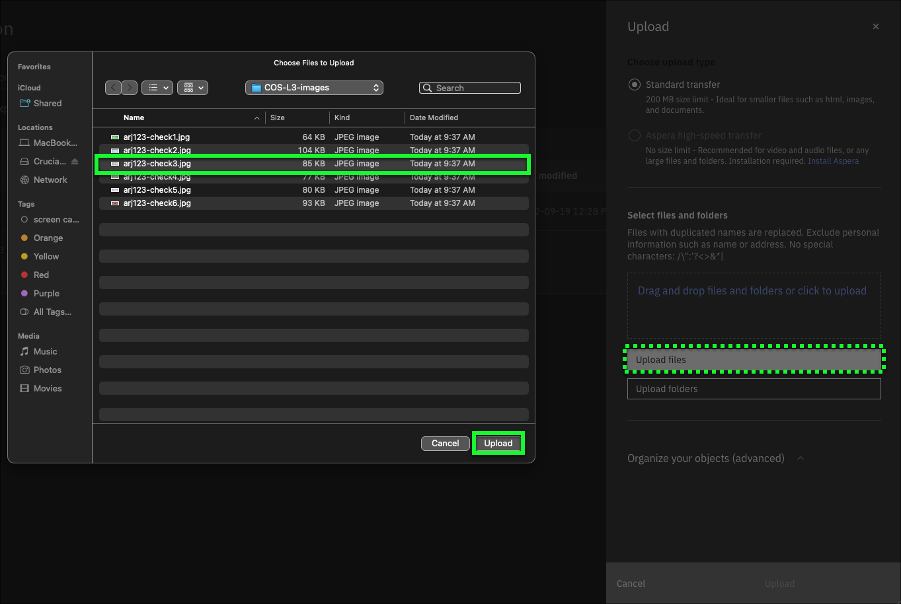
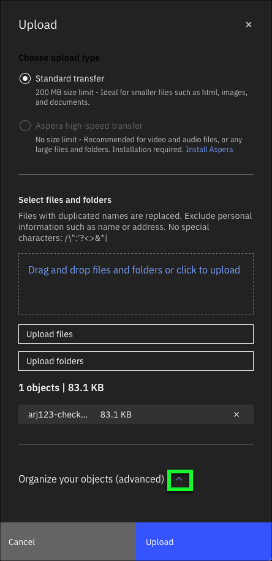
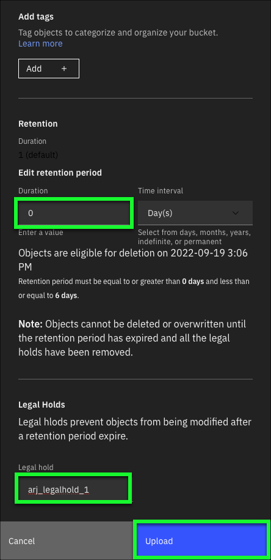
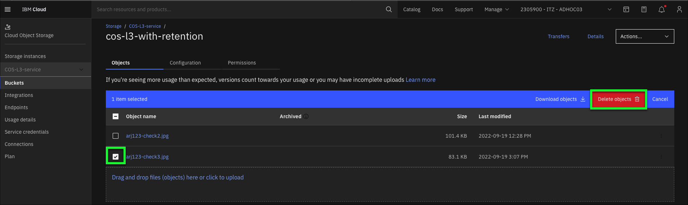
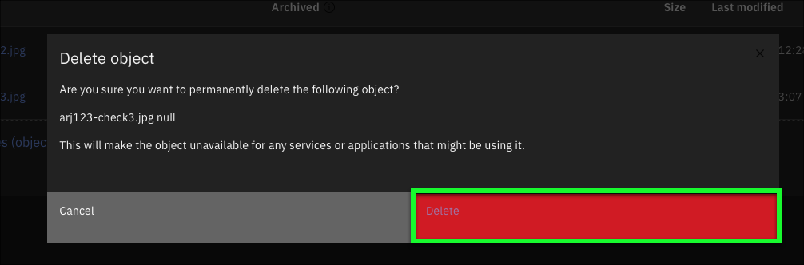
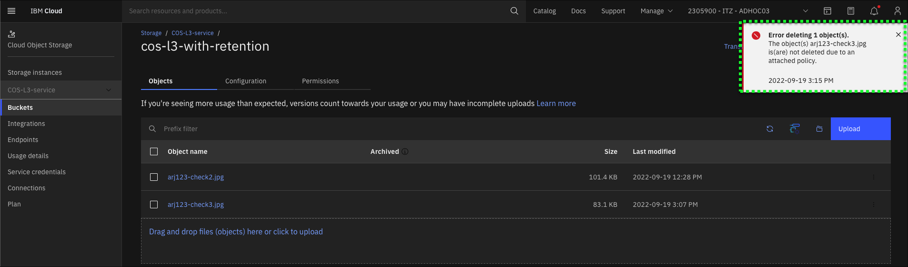
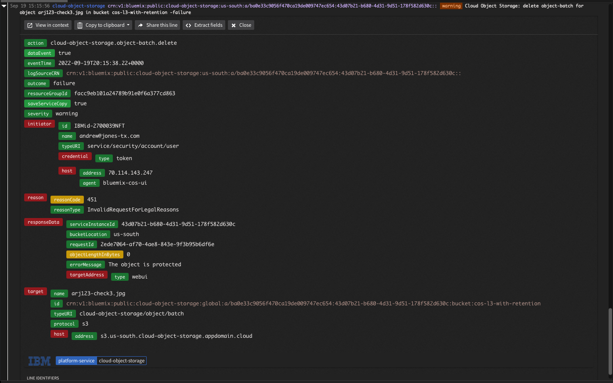
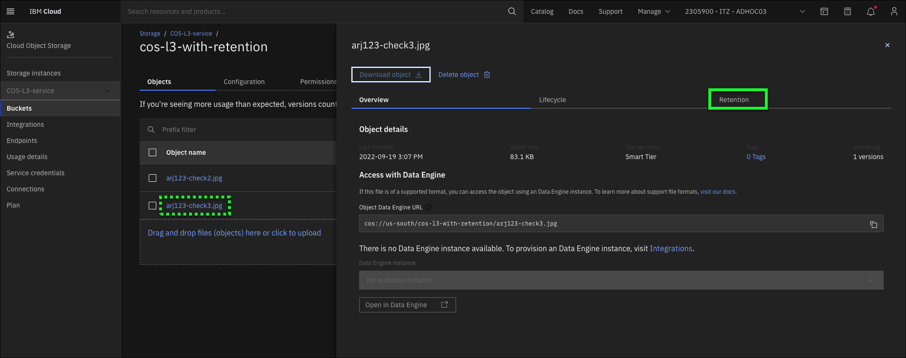
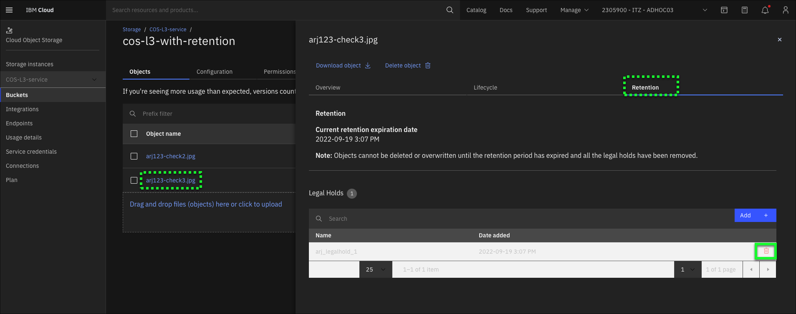
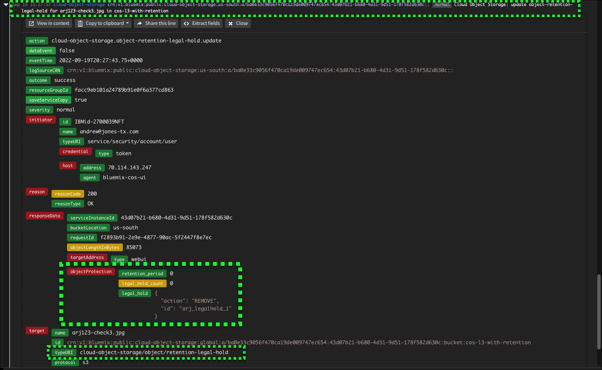

Another means to protect regulated date is through the use of **Legal holds**. Certain objects might need to be prevented from modification after a retention period expires. An example is an incomplete legal review, where records might need to be accessible for an extended duration beyond the retention period originally set. A legal hold flag can then be applied at the object level.   Legal holds can be applied to objects during initial uploads or after an object is written.   Note: A maximum of 100 legal holds can be applied per object.

Follow the steps below to create a **legal hold** on an object. If not already open, open new browser tabs or windows to the IBM Cloud Portal COS bucket details and Activity Tracker as described in Steps 1 and 2 of the previous chapter.

1. Click the **Upload** button.

2. Click the **Upload files** button.

3. In the **Choose Files to Upload** dialog, select the a file to upload to COS, and click **Upload**.

4. Click the up arrow next to the **Organize your objects (advanced)** section of the Upload dialog.

5. Set **Duration** to **0** Days.
6. Enter a unique name in the **Legal hold** text entry field.
7. Click **Upload**.

A Transfers dialog will open and after the file uploads, a success message will appear.  Close these windows by clicking the **X** at top right of each.

Recall how in the last chapter how it was possible to delete an object that had a retention period of 0 days. Now, try and delete the document just upload that has a retention of 0 days AND a **legal hold**.

8. Select the newly uploaded document and click **Delete objects**.

9. Click **Delete** in the **Delete object** dialog.

Notice the **Delete** failed. An error message should have appeared stating the **Delete** failed due

10. Switch to the **Activity Tracker** Dashboard.

11. Click to the left of the last **delete object-batch** event in the Dashboard.

The **legal hold** on the object prevents the object from being deleted even tough the retention period is set to 0 days.

12. Return to the IBM Cloud Portal, click on the last object added to view the object details page.

13. Click the **Retention** tab.

14. Click the **Trash can** icon to the right of the **Legal hold** created earlier.
15. Click **Delete** in the **Delete Legal Hold** dialog.

The **legal hold** has now been removed. A new entry in **Activity Tracker** should reflect the object has been updated as shown in the image below

Now that the **legal hold** has been removed, the object can be deleted as it's retention period is set to 0 days and there are no **legal holds** on the object.

Technical sellers should proceed to Part 8 and explore the COS command line interfaces (CLIs).

That concludes the required parts of the demonstration script for IBM and Business Partners Sales. All are encouraged to complete Parts 8 and 9, but at this time IBM and Business Partners Sales may skip to [**Next steps**](../Next steps.md).
