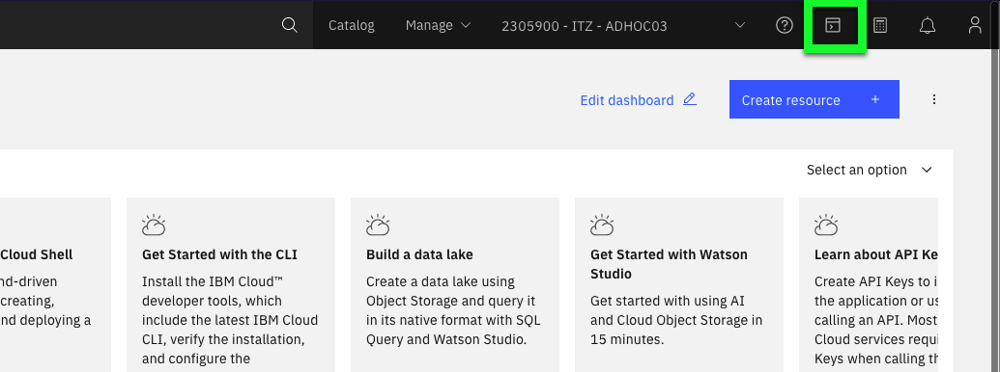

For this exercise, the IBM Cloud Shell will be used so no additional software is required. IBM Cloud Shell gives users complete control of their cloud resources, applications and infrastructure, from any web browser. IBM Cloud Shell provides pre-authenticated access to the latest tools and programming languages for cloud-based development, deployment and management of services and applications — all in a secure shell. IBM Cloud Shell is instantly accessible from the IBM Cloud portal.

Follow the seps below to learn more about the COS command line interfaces.

1. Change to the **ITZ - ADHOC03** account using the drop-down switcher, as shown in the GIF below.


!!! tip
    If the browser window is narrow, this icon:  may appear instead of the current account name as shown in the screen capture above.

2. Click the IBM Cloud Shell icon .



The next steps are performed in using the IBM Cloud Shell window that was just opened.

3. In the top-right corner of the IBM Cloud Shell window is a square icon with an "up" arrow. Click this button to upload a file — upload the SSH key downloaded earlier.

In this chapter, a similar scenario as seen in Part 7 will be used where files will be uploaded, retention periods set, and attempts to delete the objects will be made. To facilite the scenario, a script is provided that will automatically download the 6 image files to the IBM Cloud Shell environment.

!!! important
    Be sure to utilize the demonstration guides **copy**  icon to avoid typographical errors in executing commands.

4. Download the script to download the images files.

```
wget https://raw.githubusercontent.com/IBM/SalesEnablement-COS-L3/main/docs/includes/downloadImageFiles.bash
```

5. Execute the script to download the images files.

```
bash ./downloadImageFiles.bash
```

6. When prompted, enter a unique prefix to use in the file names (e.g. arj123).
7. Verify the files now exist in the IBM Cloud Shell environment.

```
ls *.jpg
```

??? example "Example output"
    arj123-check1.jpg  arj123-check2.jpg  arj123-check3.jpg  arj123-check4.jpg  arj123-check5.jpg  arj123-check6.jpg

Next, in order to use the COS CLIs, a few configuration steps must be completed.

8. Set the COS region to {{COS.serviceInstanceRegion}}.

```
ic cos config region --region "{{COS.serviceInstanceRegion}}"
```

??? example "Example output"
    OK

    Successfully saved default region. The program will look for buckets in the region us-south.


<!-- 10. Retrive the Cloud Resource Name (CRN) for the COS service instance {{COS.serviceInstanceName}}.

```
ic resource service-instance {{COS.serviceInstanceID}}}} --id
```

??? example "Example output"
    Retrieving service instance 7ae313ac-9571-4bf6-bc55-aea286699a31 in all resource groups under account ITZ - ADHOC03 as andrew@jones-tx.com...
    crn:v1:bluemix:public:kms:us-south:a/934360f4a07b734c569d05a94f71816e:7ae313ac-9571-4bf6-bc55-aea286699a31:: 7ae313ac-9571-4bf6-bc55-aea286699a31 -->

9. Set Cloud Resource Name (CRN) for the COS CLI configuration to the COS service instance ID **{{COS.serviceCRN}}.

```
ic cos config crn --crn ${{COS.serviceInstanceID}}
```

??? example "Example output"
    Saving new Service Instance ID...

    OK

    Successfully stored your service instance ID.

10. Verify CRN is set in COS CLI configuration.

```
ic cos config list
```

??? example "Example output"
    Key                     Value

    Last Updated            Monday, September 19 2022 at 21:24:46

    Default Region          us-south

    Download Location       /home/andrew/Downloads

    CRN                     7ae313ac-9571-4bf6-bc55-aea286699a31

    AccessKeyID

    SecretAccessKey

    Authentication Method   IAM

    URL Style               VHost

    Service Endpoint

11. List the **storage class** of the COS bucket.

```
ic cos bucket-class-get -bucket {{COS.bucket1}}
```

??? example "Example output"
    OK

    Details about bucket cos-l3-bucket-1:

    Region: us-south

    Class: Smart

12. List the current content of a bucket.

```
ic cos objects --bucket {{COS.bucket1}}
```

??? example "Example output"
    OK

    Found 2 objects in bucket 'cos-l3-with-retention':

    Name                Last Modified              Object Size

    arj123-check2.jpg   Sep 19, 2022 at 17:28:14   101.41 KiB

    arj123-check3.jpg   Sep 19, 2022 at 20:07:32   83.08 KiB

13. Upload a file to the COS bucket.

The next command has 2 parameters that will need to be updated prior to executing them. The **-key** option specifies the filename for the object in COS.  The **-body** option specifies the local file to be uploaded.  A unique **-key** must be specified. In the command below, change **arj123-check4.jpg** to one of the files you downloaded earlier. Be sure to select a file that has not already been uploaded.

```
ic cos object-put —bucket {{COS.bucket1}} —-key arj123-check4.jpg —-body arj123-check4.jpg
```

??? example "Example output"


# when trying to delete with Write access get:

andrew@cloudshell:~$ ic cos object-delete --bucket cos-l3-bucket-1 --key "slack.gif"
WARNING: This will permanently delete the object 'slack.gif' from the bucket 'cos-l3-bucket-1'.
Are you sure you would like to continue? [y/N]> y
FAILED
InvalidRequestForLegalReasons: The object is protected
        status code: 451, request id: db244dda-1eb8-4512-b397-21efdf3519a7, host id:


# in Activity Tracker it says “InvalidRequestForLegalReasons”


# upload a file
echo “hello world” > arj.txt
ls -l arj.txt

ic cos object-put —bucket cos-l3-bucket-1 —key arj.txt —body arj.txt

# above uses default retention period
