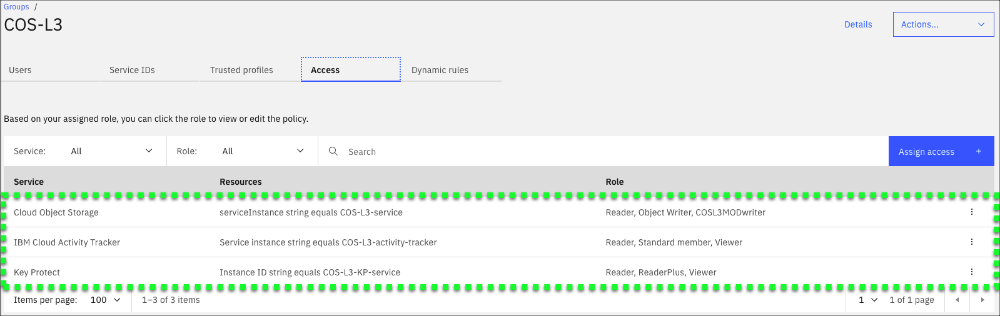
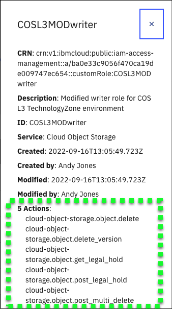

!!! important "Optional Learning Material"
    This part of the demonstration guide is optional. Technical sellers do not need to include this content in their Stand and Deliver recordings, nor will Business Partners be quizzed on this content. It is included here purely for educational purposes.

While creating the IBM Technology Zone environment used here, the developer for this demonstration guide learned something new that other technical sellers may benefit from when attempting to properly restrict access to IBM Cloud resources. If users are not already familiar with the ability to create custom Identity and Access Management (IAM) roles, this information may prove useful.

It has been mentioned several times in this demonstration guide that user IDs in the IBM Technology Zone environment for this demonstration script are restricted. To accomplish this, when the user's IBM Cloud ID is added to the IBM Cloud account, the ID is also added to two IAM **access groups**: *Public Access* and a custom group named *COS-L3*. Learn more about **access groups** <a href="https://cloud.ibm.com/docs/account?topic=account-groups&interface=ui" target="_blank">here</a>.

**Access groups** are used to organize a set of users in a container that makes it easy to assign specific sets of access roles for one or more **services** like COS. Each IBM Cloud **service** can specify roles that have specific capabilities for the service. One role may be called **Reader** which restricts the user ID to only **read** capabilities. In the case of COS, a user with only **Reader** capability could perform **get** operations on an object but not **write** or **put** operations. Roles can be assigned across the entire service or be more narrowly scoped, for instance to a specific service instance.

In this demonstration environment, the *COS-L3* access group is shown in the image below:

Notice the group includes three (3) services: Cloud Object Storage, IBM Cloud Activity Tracker, and Key Protect. And each of these is scoped to a specific **resource**, which in this case is the service instance used in the demonstration environment. And for each **resource**, specific **roles** are assigned. Now this is all fairly basic IAM capabilities.

Notice, however, that one role for COS looks different. The role has the name **COSL3MODwriter**. This is a custom role that was defined specifically for this demonstration script. Why was this custom role needed? Recall in the demonstration script, users had the ability to upload content to a bucket, download content from a bucket, create a legal hold, remove a legal hold, but NOT modify the buckets that were pre-provisioned. While the **Reader** role provided the download and query access for objects, and the **Object Writer** role provided the ability to upload objects, the ability to delete an object and manage legal holds are not provided by the **Object Writer** role. Those capabilities are provided in another role called **Writer**. So why not use the **Writer** role instead of **Object Writer**? Because **Object Writer** also provides the access to create new buckets and remove buckets. Providing users with that capability would allow any user of the shared environment to create any number of buckets and remove the shared buckets. Not good.

Now the aha moment. There is the ability in IAM to create a custom role, in this case **COSL3MODwriter**.
Custom roles allow administrators the ability to combine any number of actions for a specific service. The **COSL3MODwriter** custom role looks like:

Notice, the 5 new actions being added:

- cloud-object-storage.object.delete
- cloud-object-storage.object.delete_version
- cloud-object-storage.object.get_legal_hold
- cloud-object-storage.object.post_legal_hold
- cloud-object-stroage.object.post-multi-delete_version

By augmenting the standard **Reader** and **Object Writer** roles with the custom role, the **COS-L3** access group now provides the correct permissions to complete the scenarios defined in this demonstration script.

The brief, 2 minute video below shows the creation of both the **COSL3MODwriter** custom role and the **COS-L3** access group. The video does NOT have narration.

!!! tip
    If the video appears blurry, click the fullscreen  or ![](_attachment
