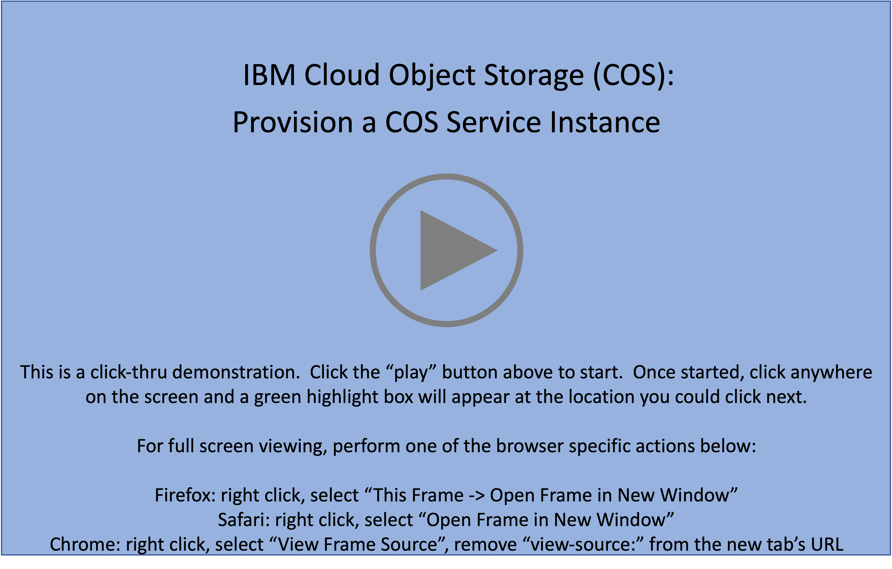

Welcome to the {{learningplan.name}} demonstration guide! The goal of this demonstration guide is to provide IBM and Business Partner Sales and Technical Sales with the knowledge and tools to perform hands-on demonstrations of {{offering.name}}. Throughout this demonstration guide {{offering.name}} will be referred to as COS.

While everyone is encouraged to complete all sections of the demonstration guide, actual completion requirements vary by role:

- IBM Sales:

    * Complete Parts 1 through 7 of this demonstration guide
    * Record and submit a Stand and Deliver demonstration to be evaluated by management (details in the Your Learning plan)

- IBM Technical Sales:

    * Complete **all** Parts of this demonstration guide
    * Record and submit a Stand and Deliver demonstration to be evaluated by management (details in the Your Learning plan)

- Business Partner Sales:

    * Complete Parts 1 through 7 of this demonstration guide
    * Successfully pass a 5 question quiz found in the learn.ibm.com plan

- Business Partner Sales:

    * Complete all Parts of this demonstration guide
    * Successfully pass a 5 question quiz found in the learn.ibm.com plan

**IBM Sales and Tech Sales** must develop and record a Stand & Deliver presentation. This video is intended to simulate delivery of a “live” demo in front of a client — on camera. IBMers will have flexibility in defining a hypothetical client, the pain points the customer has, and the goals they aspire to achieve. The recording will then cover the seller’s hands-on demonstration and pitch to the client of the value of the IBM solution using the environment and techniques of this lab. Specific criteria that must be demonstrated as part of the Stand & Deliver recordings is provided within the documentation that accompanies the Level 3 course in Your Learning.

**Business Partners** must pass an accreditation quiz after completing the hands-on portion of the course. The quiz consists of multiple choice questions, with four possible responses (and only one correct answer) for each question. **Hint: keep the demonstration guide and the associated IBM Technology Zone environment active while completing the quiz.**

Before jumping to part 1, please read the guidance below. Reading and understanding the information will save time while completing the steps in this guide.

!!! tip "FIND HELP"
    If at any point during the hands-on material help is needed, please use the <a href="{{slack.url}}" target="_blank">#cloud-platform-demo-feedback</a> Slack channel. Comments or suggestions are also welcome in this channel.

## Helpful tips for using this demonstration guide and environment

The {{guide.name}} is organized in parts and sub-parts or chapters. Most chapters contain numbered steps, which are actions to be performed.

Throughout the guide, images are used as examples of the IBM Cloud Portal and IBM Cloud Shell.

!!! warning
    The IBM Cloud Portal and {{offering.name}} changes on a regular basis and may differ from the images captured in this guide.

In some images, the following styles of highlighting are utilized:

- Action highlight box: Illustrates where to click, enter, or select an item:

- Path/explore highlight box: Illustrates one of two things:

    - the path to follow to get to a specific location in the user interface
    - areas to explore

- Copy to clipboard box: The text is copied to the clipboard. Click the copy icon (highlighted below) and then paste using the operating systems paste function, for example, entering ++ctrl++**+v**, ++cmd++**+v**, or right click and select paste.

Additionally, there are several "click-thru" demonstrations. Links to click-thru demonstrations will open in a new browser window or tab with a screen similar to the image below.

Click the play button  in the middle of the screen to start the demo. Then, simply follow the steps in the demonstration guide. If unsure where to click, click anywhere on the screen and a highlight box will appear showing where to click next.

**In this demonstration environment, full access to the IBM Cloud account is NOT provided.** User identifications (IDs) will be restricted to specific capabilities. Permission to create or modify COS service instances, COS buckets, Key Protect instances, etc. is not provided.

!!! warning
    Attempting to perform an action without the appropriate permissions will result in an error message like the one below. This is not an issue with the IBM Cloud or COS, rather a restriction of the demo environment and the permissions assigned to users.

    

## Acronyms

The following acronyms are used throughout this demonstration guide:

    - Application programming interfaces (APIs)
    - Control (ctrl) - The control key on keyboard
    - Command (cmd) - The command key on keyboard
    - Disaster Recovery (DR)
    - Gigabyte (GB)
    - High Availability (HA)
    - IBM Cloud Object Storage (COS)
    - IBM Technology Zone (TechZone)
    - Infrastructure as a Service (IaaS)
    - Input/output operations per second (IOPs)
    - Internet Protocol (IP)
    - Reliability, Availability, and Serviceability (RAS)
    - Secure Socket Shell (SSH)
    - User identification (ID)

It is now time to proceed to Part 1, an overview of {{offering.name}}.
